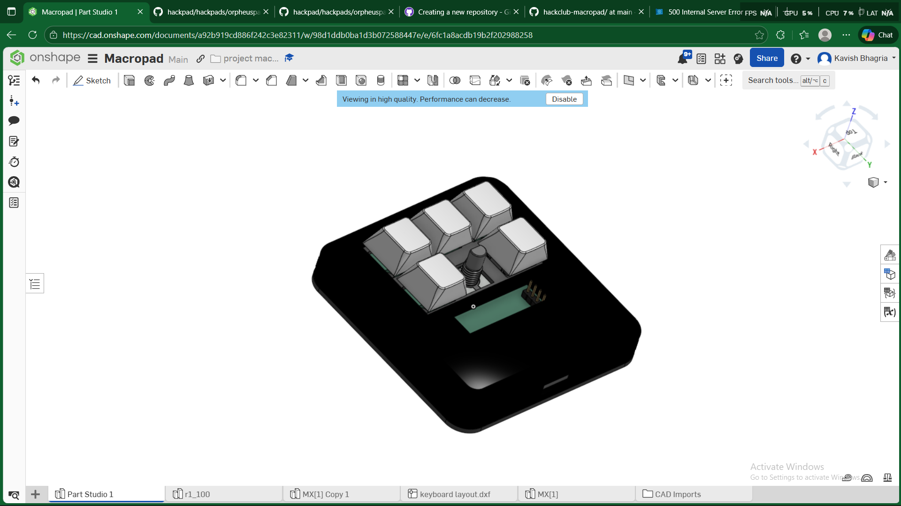
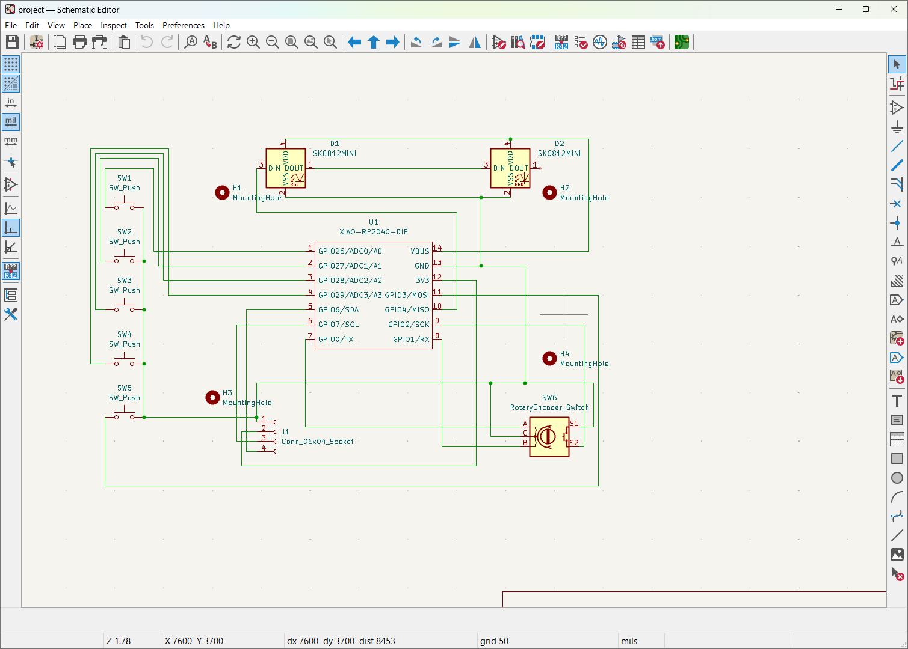
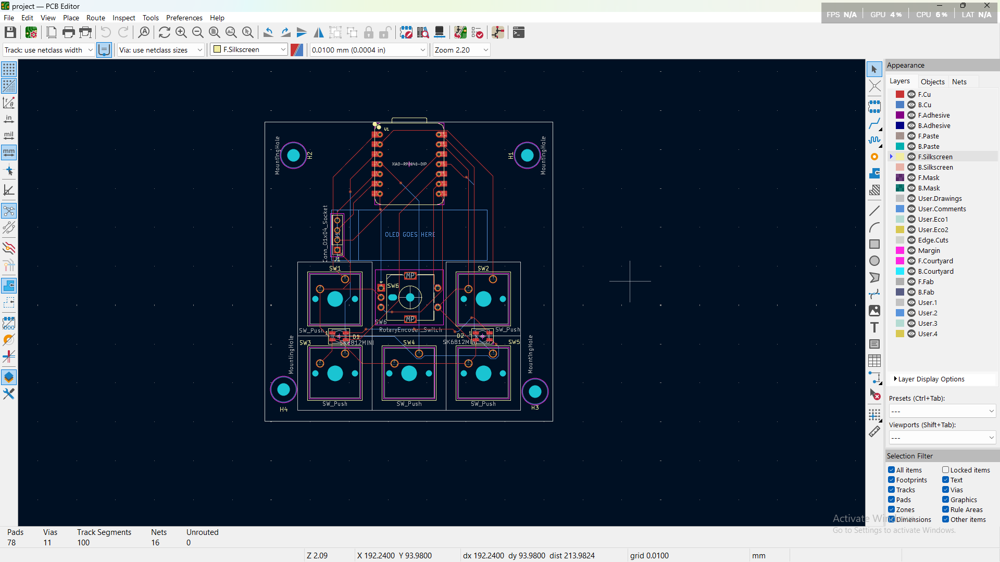
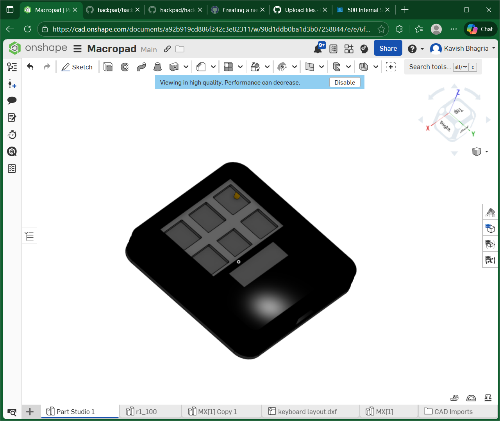

# Kavish's Macropad Project

This is my project for the Hack Club Blueprint. i wanted a controller for my pc and some robots that i am gonna build in future. So i decided to build a custom macropad with 5 keys which i think are enough for versitility. it also features a knob and an OLED display that i think feels cool!

## How it was built:
It was my first time ever designing a pcb so i would say that its not the perfect pcb but it works. I had thought that making a pcb would be such a technical challenge for me but turns out, i actually enjoyed it and learned soooo much in the process.

I designed my 3d case in onshape. It was a pain to make everyhting fit together in perfect dimension and figure out specs of cherry mx switches.

## 1. The Full Assembly

*(Note to Reviewer: This STEP file is available in the CAD folder as Macropad_Assembly.step)*

## Why I Built This
When i got my dream pc, i planned that i will be building a lot of cool projects. but turns out that as a student, i rarely had time to pull anything off. but when i came to know about this project, it gave me just the right kick to start working on a REAL PROJECT. This being my first project i am really excited to build it in real life now. i want to show it to my parents!!!! (i am very excited to see how this turns out)

This project combines my interests in electronics, 3D design, and embedded firmware. It features:
* Visual Feedback: A 0.91" OLED screen to display layers and modes.
* Analog Input: A Rotary Encoder for precise volume or scrolling control.
* Aesthetics: Underglow RGB lighting tucked between the switches.
* Ergonomics: A high-profile, 3D-printed case designed with enough clearances for Cherry MX switches.

## 2. The Electronics (Schematic)
I designed it using KiCad. it was confusing at first to figure out what goes where and which pin to connect to what component. But i managed to map everything without conflicts.

* **MCU:** Seeed XIAO RP2040
* **Display Protocol:** I2C (Pins D4/D5)
* **Lighting:** PWM/Data driver for SK6812 LEDs

## 3. The PCB Design
It was suggested to me that i use ground pour but while doing it i encountered a lot of errors. given the approaching deadline, i went with manually connecting the grounds together.

* Mounting: 4x M3 Holes aligned to the case standoffs.
* Placement: Symmetric layout with the Rotary Encoder as the centerpiece.
* Lighting: LEDs are strategically placed in the gaps between switches to create a diffuse glow.

## 4. The Mechanical Case
Designed in Onshape. This is a 3D-printable case featuring a **1.6mm integrated top plate** to perfectly snap-fit Cherry MX switches.

* Material: PLA / PETG
* **Access:** Precision cutout for USB-C cable.

## 5. Bill of Materials (BOM)
These are based on the allowed parts list submitted by the community

| Component | Quantity | Description |
| :--- | :--- | :--- |
| **Microcontroller** | 1 | Seeed XIAO RP2040 |
| **Switches** | 5 | Cherry MX Style Mechanical Switches |
| **Input** | 1 | EC11 Rotary Encoder |
| **Display** | 1 | 0.91" OLED Display (I2C) |
| **Lighting** | 2 | SK6812 MINI-E RGB LEDs |
| **Case** | 1 | Custom 3D Printed Enclosure (STL/STEP provided) |
| **Hardware** | 4 | M3 Screws |

## Firmware Plan
The board will run on **KMK Firmware** (CircuitPython). This allows for dynamic key remapping and OLED layer display without recompiling code.

**Planned Keymap:**
* Encoder: Volume Up/Down (Press to Mute)
* OLED: Displays current "Layer" (e.g., Media, Editing, Gaming)
* Keys: Play/Pause, Next, Prev, Copy, Paste

### Acknowledgments
Huge thanks to the **Hack Club Blueprint** team for making hardware engineering accessible!
